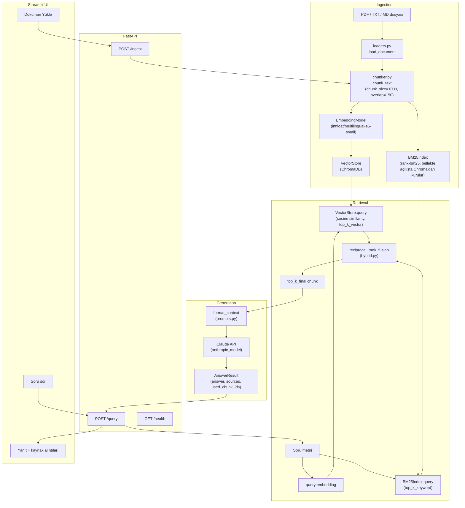

# Türkçe RAG Soru-Cevap Uygulaması

Türkçe dokümanlar (PDF, TXT, MD) üzerinde kaynak göstererek soru cevaplayan bir Retrieval-Augmented Generation (RAG) uygulaması. FastAPI tabanlı bir API, Streamlit tabanlı bir arayüz, hibrit (vektör + anahtar kelime) arama ve Claude ile yanıt üretimi içerir.

## Problem Tanımı

Türkçe içerik üzerinde çalışan kullanıcılar genellikle uzun dokümanlar (tarih, coğrafya, teknik metinler vb.) içinde belirli bir bilgiyi aramak zorunda kalır; klasik anahtar kelime aramaları eş anlamlı/farklı çekim biçimlerini yakalayamaz, büyük dil modellerine doğrudan soru sorulduğunda ise model dokümanlarda geçmeyen bilgileri "uydurabilir" (hallucination) ve hangi kaynaktan geldiği belirsiz kalır.

Bu proje şu ihtiyacı çözer: kullanıcı kendi Türkçe dokümanlarını yükler, doğal dilde bir soru sorar ve sistem yalnızca yüklenen dokümanlardaki bilgiye dayanarak, hangi dosyadan ve (varsa) hangi sayfadan geldiğini gösteren kaynaklı bir yanıt üretir. Dokümanlarda cevap yoksa sistem bunu açıkça belirtir ("Dokümanlarda bu bilgi yok.") ve yanıt uydurmaz.

## Mimari

Akış; doküman yükleme (ingestion) → hibrit arama (retrieval) → yanıt üretimi (generation) → API → kullanıcı arayüzü (UI) şeklinde ilerler:



Kod tabanındaki bileşen dizini:

- `src/rag_tr/ingestion/` — `loaders.py` (PDF/TXT/MD okuma), `chunker.py` (parçalama)
- `src/rag_tr/retrieval/` — `embeddings.py`, `vector_store.py` (ChromaDB), `keyword_search.py` (BM25), `hybrid.py` (RRF)
- `src/rag_tr/generation/` — `answerer.py`, `prompts.py` (Claude çağrısı, sistem prompt'u)
- `src/rag_tr/api/` — `main.py` (FastAPI uygulaması), `routes.py` (`/ingest`, `/query`, `/health`), `schemas.py` (Pydantic modelleri)
- `src/rag_tr/service.py` — yukarıdaki bileşenleri birleştiren `RAGService`
- `ui/streamlit_app.py` — Streamlit arayüzü

## Kurulum

### Gereksinimler

- Python 3.11+
- [uv](https://docs.astral.sh/uv/) paket yöneticisi
- Geçerli bir Anthropic API anahtarı (yanıt üretimi için)

### Adımlar

1. Bağımlılıkları yükleyin:

   ```bash
   uv sync
   ```

2. `.env` dosyasını oluşturun ve doldurun:

   ```bash
   cp .env.example .env
   ```

   `.env` içindeki `ANTHROPIC_API_KEY` alanına **gerçek bir Anthropic API anahtarı** girmeniz gerekir — `.env.example`'daki `sk-ant-your-key-here` yalnızca bir yer tutucudur ve onunla uygulama soru yanıtlayamaz (yalnızca `/health` uç noktası ve doküman yükleme çalışır, `/query` Claude API'ye gerçek bir anahtarla istek atar). Diğer alanlar (`ANTHROPIC_MODEL`, `EMBEDDING_MODEL_NAME`, `CHUNK_SIZE`, `CHUNK_OVERLAP`, `TOP_K_VECTOR`, `TOP_K_KEYWORD`, `TOP_K_FINAL`, `RRF_K`, `CHROMA_PERSIST_DIR`) için makul varsayılanlar zaten tanımlıdır, gerekmedikçe değiştirmenize gerek yoktur.

3. API'yi başlatın:

   ```bash
   uv run uvicorn rag_tr.api.main:app --port 8000
   ```

4. Ayrı bir terminalde Streamlit arayüzünü başlatın:

   ```bash
   uv run streamlit run ui/streamlit_app.py
   ```

   Arayüz varsayılan olarak `http://localhost:8000` adresindeki API'ye bağlanır (`API_URL` ortam değişkeniyle değiştirilebilir).

### Alternatif: Docker Compose

API'yi ve UI'ı ayrı container'larda çalıştırmak için:

```bash
docker compose up --build
```

Bu komut `Dockerfile.api` ve `Dockerfile.ui`'yi build eder; API `8000`, UI `8501` portunda yayına açılır ve UI, `API_URL=http://api:8000` üzerinden API container'ına bağlanır. `.env` dosyası `env_file: .env` ile API container'ına aktarılır, bu nedenle Docker ile çalıştırmadan önce de yukarıdaki 2. adımdaki gibi `.env` içine geçerli bir `ANTHROPIC_API_KEY` girilmiş olmalıdır. Veriler (`./data`) API container'ına volume olarak bağlanır, böylece Chroma index'i container yeniden başlatıldığında kaybolmaz.

## Kullanım

### Arayüz üzerinden

1. Streamlit sayfasının sol panelindeki **"Doküman Yükle"** alanından bir veya birden fazla PDF/TXT/MD dosyası seçip **"Yükle"** butonuna basın. Kaç dosyanın işlendiği ve kaç chunk oluşturulduğu bilgisi ekranda gösterilir.
2. Ana ekrandaki soru kutusuna Türkçe bir soru yazıp **"Sor"** butonuna basın (örn. *"Osmanlı Devleti hangi yılda kuruldu?"*). Yanıt, altında numaralandırılmış kaynak alıntılarıyla (dosya adı, varsa sayfa numarası) birlikte gösterilir.

### API üzerinden (curl örnekleri)

**Doküman yükleme (`POST /ingest`, `multipart/form-data`, alan adı `files`):**

```bash
curl -X POST http://localhost:8000/ingest \
  -F "files=@data/sample/osmanli_tarihi.md" \
  -F "files=@data/sample/turkiye_cografyasi.md"
```

Örnek yanıt:

```json
{
  "ingested_files": ["osmanli_tarihi.md", "turkiye_cografyasi.md"],
  "failed_files": [],
  "chunk_count": 12
}
```

**Soru sorma (`POST /query`, `application/json`):**

```bash
curl -X POST http://localhost:8000/query \
  -H "Content-Type: application/json" \
  -d '{"question": "Osmanlı Devleti hangi yılda kuruldu?"}'
```

`top_k` alanı isteğe bağlıdır (verilmezse `TOP_K_FINAL` kullanılır):

```bash
curl -X POST http://localhost:8000/query \
  -H "Content-Type: application/json" \
  -d '{"question": "Osmanlı Devleti hangi yılda kuruldu?", "top_k": 3}'
```

Örnek yanıt:

```json
{
  "answer": "Osmanlı Devleti 1299 yılında kurulmuştur. [1]",
  "sources": [
    {
      "index": 1,
      "source_file": "osmanli_tarihi.md",
      "page_number": null,
      "text": "Osmanlı Devleti 1299 yılında Söğüt'te kurulmuştur..."
    }
  ],
  "used_chunk_ids": ["osmanli_tarihi.md::0"],
  "status": "answered"
}
```

**Sağlık kontrolü (`GET /health`):**

```bash
curl http://localhost:8000/health
```

```json
{"status": "ok", "embedding_model": "intfloat/multilingual-e5-small", "chunk_count": 12, "keyword_index_size": 12}
```

### Makine-okunur sözleşme (agent entegrasyonu için)

`/query` yanıtındaki `status` alanı, çağıran tarafın serbest metni parse etmesine gerek kalmadan sonucu sınıflandırmasını sağlar:

| `status` | Anlamı |
|---|---|
| `answered` | Bağlamdan kaynak göstererek cevap üretildi; `sources` ve `used_chunk_ids` doludur. |
| `no_relevant_context` | Hiç doküman yüklenmemiş, retrieval sonuç döndürmemiş veya Claude bağlamda cevap olmadığına karar vermiş. `answer` alanı `"Dokümanlarda bu bilgi yok."`, `sources`/`used_chunk_ids` boş listedir. |

Hata durumlarında HTTP gövdesi `{"detail": {"code": ..., "message": ...}}` şeklindedir ve `code` sabit bir değerdir (`src/rag_tr/contracts.py`):

| HTTP | `code` | Anlamı |
|---|---|---|
| 502 | `generation_error` | Claude (upstream) çağrısı başarısız — yeniden denemek anlamlı olabilir. |
| 500 | `retrieval_error` | Embedding/vektör deposu/keyword index tarafında hata — yeniden denemek genelde yardımcı olmaz. |
| 400 | `invalid_filename` | Dosya adı boş, `.` veya `..`. |
| 400 | `unsupported_file_type` | Uzantı `.pdf`/`.txt`/`.md` dışında. |
| 422 | — | Pydantic doğrulama hatası (örn. boş `question`, `top_k=0`). `top_k` verilecekse en az 1 olmalıdır; 0 artık sessizce varsayılana düşmez. |

## Tasarım Kararları

**Neden hibrit arama (vektör + BM25)?**
Salt vektör (embedding) araması, anlamsal olarak yakın metinleri iyi yakalar ama nadir geçen terimlerde, özel adlarda ve tam eşleşme gerektiren ifadelerde (örneğin bir kişi adı, bir tarih, bir teknik terim) zayıf kalabilir; embedding modeli bu tür token'ları genel bir anlam uzayına sıkıştırdığı için ayırt ediciliği kaybedebilir. BM25 gibi klasik bir anahtar kelime araması ise tam token eşleşmesinde güçlüdür ama çekim ekleri farklı olan kelimeleri (örn. "başkenti" vs. "başkentidir") yakalayamaz — geliştirme sürecinde `keyword_search.py` üzerinde yapılan manuel doğrulama tam olarak bunu gösterdi: BM25Okapi exact-token eşleşmesi yaptığından, sorgudaki bir kelimenin dokümandaki çekimli hali skor üretmiyor ve o chunk sonuç listesinden düşüyordu. Bu iki yöntem birbirinin zayıf noktalarını tamamlıyor: BM25'in kaçırdığı çekimli/eş anlamlı ifadeleri vektör araması anlamsal benzerlikle yakalıyor, vektör aramanın "bulanıklaştırdığı" özel adları/nadir terimleri ise BM25 tam eşleşmeyle yakalıyor. Bu yüzden ikisinin sonuçları ayrı ayrı alınıp `reciprocal_rank_fusion` ile birleştiriliyor.

**Neden `chunk_size=1000` / `overlap=150`?**
1000 karakterlik chunk boyutu, Türkçe dokümanlardaki ortalama bir paragrafın (birkaç cümlelik bir fikir birimi) tamamını tek bir chunk içinde tutacak kadar büyük, ama chunk içine alakasız birden fazla konuyu sıkıştırmayacak kadar da küçük tutulmuştur — bu da hem embedding modelinin (`intfloat/multilingual-e5-small`, kısa-orta uzunlukta metinler için optimize edilmiş, sınırlı bağlam penceresine sahip bir model) tek bir chunk'ı anlamlı şekilde temsil edebilmesini, hem de yanıt üretimi sırasında Claude'a gönderilen bağlamın gereksiz yere şişmemesini sağlar. 150 karakterlik overlap ise, bir cümlenin veya fikrin tam chunk sınırında bölünüp bağlamının iki parçaya dağılmasını engeller; bir chunk'ın sonunda yarım kalan bir bilginin bir sonraki chunk'ın başında da tekrar etmesini sağlayarak retrieval sırasında ilgili bilginin en az bir chunk içinde bütün halde bulunmasını garanti eder.

**Neden yerel (lokal) embedding modeli?**
`intfloat/multilingual-e5-small` modeli `sentence-transformers` ile yerel olarak (kendi makinede/container'da) çalıştırılıyor; bulut tabanlı bir embedding API'sine her chunk ve her sorgu için ayrı bir istek atmak yerine, model bir kez indirilip belleğe yükleniyor ve sonraki tüm `encode_passages`/`encode_query` çağrıları ek API maliyeti veya ağ gecikmesi olmadan çalışıyor. Bu, özellikle çok sayıda doküman ingest edilirken (yüzlerce chunk için embedding üretimi) önemli bir maliyet/gecikme avantajı sağlıyor. Ayrıca bu model çok dilli (multilingual) olarak eğitildiği için Türkçe metinlerde de iyi performans gösteriyor; sadece yanıt üretimi (generation) adımında, doğal dil anlama/üretme gerektiren kısımda Claude API'ye (ücretli, ağ üzerinden) başvuruluyor.

**Neden RRF (Reciprocal Rank Fusion)?**
Vektör aramasının döndürdüğü skorlar (cosine similarity, genelde 0-1 aralığında) ile BM25'in döndürdüğü skorlar (sınırsız, corpus'a ve terim frekansına bağlı, tamamen farklı bir ölçekte) doğrudan karşılaştırılamaz veya toplanamaz — hangi skorun "daha iyi" olduğunu belirlemek için ek bir normalizasyon adımı gerekirdi ve bu normalizasyon genellikle keyfi/kırılgan olur. RRF bu sorunu skorları tamamen görmezden gelerek çözer: her iki sonuç listesindeki chunk'ları yalnızca sıralarına (rank) göre değerlendirir ve `1 / (rank + k)` formülüyle bir puan verir (`hybrid.py`'deki `reciprocal_rank_fusion`, `k=rrf_k`). Böylece bir chunk her iki listede de üst sıralarda çıkıyorsa toplam puanı yükselir, listelerden yalnızca birinde çıkıyorsa da yine de makul bir puan alır — hiçbir skor ölçeğini diğerine göre normalize etmeye gerek kalmadan, adil ve basit bir birleştirme yapılmış olur.

## Agent ve Değerlendirme Katmanı

```
Kullanıcı sorusu → Agent → (karar) → RAG retrieval → gerekçeli cevap → Promptevals
```

**RAG** (`src/rag_tr/`) retrieval sağlar: `RAGService.retrieve()` Claude çağırmadan tiplenmiş `Passage` listesi döndürür.

**Agent** (`src/rag_tr/agent/`) bu retrieval'ı bir *tool* olarak kullanır. Sabit bir pipeline değil, açık bir karar döngüsüdür: arama gerekip gerekmediğine karar verir (gerekmiyorsa RAG'ı hiç çağırmaz), dönen pasajları denetler, gerekirse sorguyu yeniden formülleyip tekrar arar ve yeterli bağlam yoksa cevap üretmeyi reddeder. LLM sağlayıcısı `AgentLLM` arkasında soyutlanmıştır (`gemini.py`, Gemini free tier).

**Promptevals** (ayrı proje, `../LLM`) agent'ın *davranışını* ölçer. Amaç "agent'ı yaptım" değil, "davranışını ölçtüm" diyebilmektir: `eval/agent_suite.yaml` içindeki her vaka tek bir string eşleşmesi yerine gözlemlenebilir davranışı denetler — hangi status döndü, RAG gerçekten çağrıldı mı, gereksiz arama yapıldı mı, doğru kaynak gösterildi mi, atıf formatı doğru mu, korpus dışı soruda uydurma yapıldı mı. Kontrolleri promptevals'ın kendi assertion checker'ları yapar; burada hiçbir evaluator mantığı tekrar yazılmaz ve promptevals RAG'ın içini bilmez — kendisine yalnızca gözlemlenebilir metin gider. Vakaların çoğu deterministik ve ücretsizdir; LLM judge yalnızca gerçekten anlamsal değerlendirme gereken tek vakada kullanılır.

```bash
# Agent'ı tek soruyla canlı denemek (Gemini free tier)
uv run --no-editable python scripts/agent_smoke.py

# Agent davranış değerlendirmesi (opt-in, küçük suite)
uv run --no-editable python scripts/agent_eval.py
```

Testler tamamen fake LLM/RAG bileşenleriyle çalışır; normal test koşusu hiçbir API çağrısı yapmaz.

## Geliştirme Fikirleri

- **Reranker modeli eklenmesi:** RRF ile birleştirilen ilk sonuçların üzerine, cross-encoder tabanlı bir reranker (örn. bir Türkçe/çok dilli cross-encoder modeli) uygulanarak `top_k_final` öncesi sonuçların isabet oranı artırılabilir.
- **Streaming yanıt:** Claude API'nin streaming modu kullanılarak `/query` uç noktası token token yanıt döndürebilir, Streamlit arayüzü de yanıtı üretilirken gösterebilir (şu anda `generate_answer` tam yanıtı tek seferde bekliyor).
- **BM25 yeniden kurma maliyetinin azaltılması:** `BM25Index` bellekte yaşıyor ama artık restart sonrası kaybolmuyor: `RAGService.rebuild_keyword_index()` açılışta index'i ChromaDB'deki kalıcı chunk metinlerinden yeniden kuruyor (tek kaynak-of-truth vektör deposu, dolayısıyla iki depo arasında tutarsızlık oluşmuyor). Çok büyük corpus'larda bu yeniden kurma açılış süresini uzatabilir; o noktada tokenize edilmiş corpus'un diske cache'lenmesi düşünülebilir.
- **Çoklu kullanıcı/oturum desteği:** Şu anda tüm kullanıcılar aynı `VectorStore`/`BM25Index`'i paylaşıyor; kullanıcı/oturum bazlı koleksiyon ayrımı (örn. Chroma'da kullanıcı başına ayrı koleksiyon) eklenerek farklı kullanıcıların dokümanları birbirinden izole edilebilir.
- **Semantic caching:** Sık sorulan veya anlamsal olarak birbirine çok yakın sorular için, embedding benzerliğine dayalı bir önbellek eklenerek hem Claude API maliyeti hem de yanıt süresi azaltılabilir.
- **Değerlendirme otomasyonu:** `eval/questions.json` içindeki soru-cevap çiftleri kullanılarak, `/query` uç noktasının ürettiği yanıtların beklenen yanıtlarla otomatik karşılaştırıldığı bir eval script'i (örn. cevap içinde beklenen anahtar bilgilerin geçip geçmediğini kontrol eden veya bir LLM-judge kullanan) yazılabilir; bu script CI'a bağlanarak regresyonlar erken yakalanabilir.
