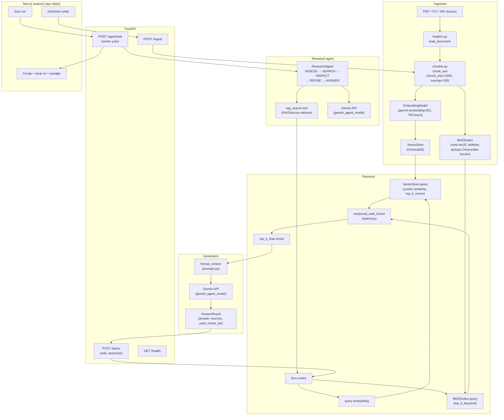

# Türkçe RAG Soru-Cevap Uygulaması

Türkçe dokümanlar (PDF, TXT, MD) üzerinde kaynak göstererek soru cevaplayan bir Retrieval-Augmented Generation (RAG) uygulaması. FastAPI tabanlı bir API, hibrit (vektör + anahtar kelime) arama, aramanın gerekip gerekmediğine kendisi karar veren bir araştırma agent'ı ve Gemini ile yanıt üretimi içerir. Arayüz ayrı bir Next.js deposunda (`agent-lab-web`) durur; bu depodaki Streamlit uygulaması artık opsiyonel `legacy` eki olarak korunuyor.

## Problem Tanımı

Türkçe içerik üzerinde çalışan kullanıcılar genellikle uzun dokümanlar (tarih, coğrafya, teknik metinler vb.) içinde belirli bir bilgiyi aramak zorunda kalır; klasik anahtar kelime aramaları eş anlamlı/farklı çekim biçimlerini yakalayamaz, büyük dil modellerine doğrudan soru sorulduğunda ise model dokümanlarda geçmeyen bilgileri "uydurabilir" (hallucination) ve hangi kaynaktan geldiği belirsiz kalır.

Bu proje şu ihtiyacı çözer: kullanıcı kendi Türkçe dokümanlarını yükler, doğal dilde bir soru sorar ve sistem yalnızca yüklenen dokümanlardaki bilgiye dayanarak, hangi dosyadan ve (varsa) hangi sayfadan geldiğini gösteren kaynaklı bir yanıt üretir. Dokümanlarda cevap yoksa sistem bunu açıkça belirtir ("Dokümanlarda bu bilgi yok.") ve yanıt uydurmaz.

## Mimari

Akış; doküman yükleme (ingestion) → hibrit arama (retrieval) → yanıt üretimi (generation) → API → kullanıcı arayüzü (UI) şeklinde ilerler:



Kod tabanındaki bileşen dizini:

- `src/rag_tr/ingestion/` — `loaders.py` (PDF/TXT/MD okuma), `chunker.py` (parçalama)
- `src/rag_tr/retrieval/` — `embeddings.py`, `vector_store.py` (ChromaDB), `keyword_search.py` (BM25), `hybrid.py` (RRF)
- `src/rag_tr/generation/` — `answerer.py`, `prompts.py` (yanıt üretimi, sistem prompt'u)
- `src/rag_tr/agent/` — `research_agent.py` (ASSESS → SEARCH → INSPECT → REFINE → ANSWER durum makinesi), `gemini_llm.py`, `tools.py`, `contracts.py`
- `src/rag_tr/api/` — `main.py` (uygulama fabrikası, CORS, hata işleyicileri), `routes.py` (`/ingest`, `/query`, `/upload`, `/health`), `agent_routes.py` (`/agent/ask`), `errors.py` (tek tip hata gövdesi), `schemas.py`
- `src/rag_tr/service.py` — yukarıdaki bileşenleri birleştiren `RAGService`
- `scripts/ingest.py` — dağıtım sonrası korpusa doküman ekleyen operatör aracı
- `ui/streamlit_app.py` — eski Streamlit arayüzü (opsiyonel `legacy` eki)

## Kurulum

### Gereksinimler

- Python 3.11+
- [uv](https://docs.astral.sh/uv/) paket yöneticisi
- Bir Gemini API anahtarı ([Google AI Studio](https://aistudio.google.com/apikey) ücretsiz katmanı yeterlidir)

Üretim yolunda tek sağlayıcı Gemini'dir: hem cevap üretimi (`gemini-2.5-flash`) hem de
embedding (`gemini-embedding-001`) aynı anahtarla çalışır. Anthropic artık yalnızca
eski `POST /query` uç noktasının kullandığı opsiyonel bir ek paket (`legacy` extra);
üretim bağımlılıkları arasında yer almaz ve kurulmadığında uygulama normal çalışır.

### Adımlar

1. Bağımlılıkları yükleyin:

   ```bash
   uv sync --no-editable
   ```

   `--no-editable` bilinçli bir tercih: depo OneDrive altında ve yolunda Türkçe karakter
   bulunan bir dizinde durduğunda editable kurulumun ürettiği `.pth` dosyası Windows'un
   cp1254 kod sayfasıyla okunamıyor ve içe aktarma kırılıyor. Kaynak dosyaları
   değiştirdikten sonra kurulu kopyayı yenilemek için
   `uv sync --no-editable --reinstall-package rag_tr` çalıştırın.

2. `.env` dosyasını oluşturun ve doldurun:

   ```bash
   cp .env.example .env
   ```

   Zorunlu tek alan `GEMINI_API_KEY`'dir. Anahtar yalnızca ortamdan okunur; depoya,
   Docker image'ına veya loglara hiçbir zaman yazılmaz. Diğer alanlar
   (`GEMINI_AGENT_MODEL`, `EMBEDDING_MODEL_NAME`, `EMBEDDING_DIMENSIONS`, `CHUNK_SIZE`,
   `CHUNK_OVERLAP`, `TOP_K_VECTOR`, `TOP_K_KEYWORD`, `TOP_K_FINAL`, `RRF_K`,
   `CHROMA_PERSIST_DIR`, `UPLOAD_ENABLED`, `INGEST_API_TOKEN`, `ALLOWED_ORIGINS`) makul
   varsayılanlarla gelir; üretim değerleri için [Dağıtım](#dağıtım-deployment)
   bölümüne bakın.

3. API'yi başlatın:

   ```bash
   uv run uvicorn rag_tr.api.main:app --port 8000
   ```

4. Doküman ekleyin ve soru sorun — uç noktaların tamamı [API](#api) bölümünde:

   ```bash
   # korpusa doküman ekleme (operatör yolu, token gerektirir)
   RAG_API_URL=http://localhost:8000 INGEST_API_TOKEN=... uv run python scripts/ingest.py data/raw

   # agent'a soru sorma
   curl -s localhost:8000/agent/ask -H 'content-type: application/json'      -d '{"question": "Osmanlı Devleti hangi yılda kuruldu?"}'
   ```

5. Web arayüzü ayrı bir depoda (`agent-lab-web`, Next.js). Yalnızca `AGENT_API_URL`
   ortam değişkeniyle bu API'ye bağlanır; ayrıntılar
   [Next.js arayüzü](#nextjs-arayüzü) bölümünde.

### Alternatif: Docker

API container'ı `Dockerfile.api` ile build edilir:

```bash
docker build -f Dockerfile.api -t rag-tr-api .
docker run --rm -p 8000:8000 -e GEMINI_API_KEY=... -v "$PWD/data:/app/data" rag-tr-api
```

Secret'lar image'a gömülmez, çalışma zamanında ortam değişkeni olarak geçirilir.
`data/` dizini volume olarak bağlanır; böylece Chroma index'i container yeniden
başladığında kaybolmaz. Eski Streamlit arayüzünü de ayağa kaldıran
`docker compose up --build` hâlâ çalışır ama Streamlit artık opsiyonel `legacy`
ek paketine bağlı ve üretim yolunun parçası değil.

## Kullanım

### Arayüz üzerinden

Web arayüzü ayrı bir depoda duruyor (`agent-lab-web`, Next.js). `AGENT_API_URL` bu API'yi
gösterecek şekilde ayarlandığında Playground sayfasındaki soru alanı `/agent/ask`'e gider
ve cevabı, agent'ın karar izini, yaptığı tool çağrılarını ve dayandığı pasajları birlikte
gösterir. Yükleme paneli yalnızca sunucuda `UPLOAD_ENABLED=true` ise etkindir.

Bu depodaki `ui/streamlit_app.py` eski arayüzdür; `uv sync --extra legacy` ile kurulabilir
ama üretim yolunun parçası değildir.

### API üzerinden (curl örnekleri)

**Doküman yükleme (`POST /ingest`, `multipart/form-data`, alan adı `files`):**

```bash
curl -X POST http://localhost:8000/ingest \
  -F "files=@data/sample/osmanli_tarihi.md" \
  -F "files=@data/sample/turkiye_cografyasi.md"
```

Örnek yanıt:

```json
{
  "ingested_files": ["osmanli_tarihi.md", "turkiye_cografyasi.md"],
  "failed_files": [],
  "chunk_count": 12
}
```

**Soru sorma (`POST /query`, `application/json`):**

```bash
curl -X POST http://localhost:8000/query \
  -H "Content-Type: application/json" \
  -d '{"question": "Osmanlı Devleti hangi yılda kuruldu?"}'
```

`top_k` alanı isteğe bağlıdır (verilmezse `TOP_K_FINAL` kullanılır):

```bash
curl -X POST http://localhost:8000/query \
  -H "Content-Type: application/json" \
  -d '{"question": "Osmanlı Devleti hangi yılda kuruldu?", "top_k": 3}'
```

Örnek yanıt:

```json
{
  "answer": "Osmanlı Devleti 1299 yılında kurulmuştur. [1]",
  "sources": [
    {
      "index": 1,
      "source_file": "osmanli_tarihi.md",
      "page_number": null,
      "text": "Osmanlı Devleti 1299 yılında Söğüt'te kurulmuştur..."
    }
  ],
  "used_chunk_ids": ["osmanli_tarihi.md::0"],
  "status": "answered"
}
```

**Sağlık kontrolü (`GET /health`):**

```bash
curl http://localhost:8000/health
```

```json
{"status": "ok", "embedding_model": "gemini-embedding-001", "chunk_count": 12, "keyword_index_size": 12}
```

### Makine-okunur sözleşme (agent entegrasyonu için)

`/query` yanıtındaki `status` alanı, çağıran tarafın serbest metni parse etmesine gerek kalmadan sonucu sınıflandırmasını sağlar:

| `status` | Anlamı |
|---|---|
| `answered` | Bağlamdan kaynak göstererek cevap üretildi; `sources` ve `used_chunk_ids` doludur. |
| `no_relevant_context` | Hiç doküman yüklenmemiş, retrieval sonuç döndürmemiş veya model bağlamda cevap olmadığına karar vermiş. `answer` alanı `"Dokümanlarda bu bilgi yok."`, `sources`/`used_chunk_ids` boş listedir. |

Hata durumlarında HTTP gövdesi `{"detail": {"code": ..., "message": ...}}` şeklindedir ve `code` sabit bir değerdir (`src/rag_tr/contracts.py`):

| HTTP | `code` | Anlamı |
|---|---|---|
| 502 | `generation_error` | Model (upstream) çağrısı başarısız — yeniden denemek anlamlı olabilir. |
| 500 | `retrieval_error` | Embedding/vektör deposu/keyword index tarafında hata — yeniden denemek genelde yardımcı olmaz. |
| 400 | `invalid_filename` | Dosya adı boş, `.` veya `..`. |
| 400 | `unsupported_file_type` | Uzantı `.pdf`/`.txt`/`.md` dışında. |
| 422 | — | Pydantic doğrulama hatası (örn. boş `question`, `top_k=0`). `top_k` verilecekse en az 1 olmalıdır; 0 artık sessizce varsayılana düşmez. |

## Tasarım Kararları

**Neden hibrit arama (vektör + BM25)?**
Salt vektör (embedding) araması, anlamsal olarak yakın metinleri iyi yakalar ama nadir geçen terimlerde, özel adlarda ve tam eşleşme gerektiren ifadelerde (örneğin bir kişi adı, bir tarih, bir teknik terim) zayıf kalabilir; embedding modeli bu tür token'ları genel bir anlam uzayına sıkıştırdığı için ayırt ediciliği kaybedebilir. BM25 gibi klasik bir anahtar kelime araması ise tam token eşleşmesinde güçlüdür ama çekim ekleri farklı olan kelimeleri (örn. "başkenti" vs. "başkentidir") yakalayamaz — geliştirme sürecinde `keyword_search.py` üzerinde yapılan manuel doğrulama tam olarak bunu gösterdi: BM25Okapi exact-token eşleşmesi yaptığından, sorgudaki bir kelimenin dokümandaki çekimli hali skor üretmiyor ve o chunk sonuç listesinden düşüyordu. Bu iki yöntem birbirinin zayıf noktalarını tamamlıyor: BM25'in kaçırdığı çekimli/eş anlamlı ifadeleri vektör araması anlamsal benzerlikle yakalıyor, vektör aramanın "bulanıklaştırdığı" özel adları/nadir terimleri ise BM25 tam eşleşmeyle yakalıyor. Bu yüzden ikisinin sonuçları ayrı ayrı alınıp `reciprocal_rank_fusion` ile birleştiriliyor.

**Neden `chunk_size=1000` / `overlap=150`?**
1000 karakterlik chunk boyutu, Türkçe dokümanlardaki ortalama bir paragrafın (birkaç cümlelik bir fikir birimi) tamamını tek bir chunk içinde tutacak kadar büyük, ama chunk içine alakasız birden fazla konuyu sıkıştırmayacak kadar da küçük tutulmuştur — bu da hem embedding modelinin tek bir chunk'ı anlamlı şekilde temsil edebilmesini, hem de yanıt üretimi sırasında modele gönderilen bağlamın gereksiz yere şişmemesini sağlar. 150 karakterlik overlap ise, bir cümlenin veya fikrin tam chunk sınırında bölünüp bağlamının iki parçaya dağılmasını engeller; bir chunk'ın sonunda yarım kalan bir bilginin bir sonraki chunk'ın başında da tekrar etmesini sağlayarak retrieval sırasında ilgili bilginin en az bir chunk içinde bütün halde bulunmasını garanti eder.

**Neden yerel embedding modeli yerine Gemini embedding API'si?**
Proje başlangıçta `intfloat/multilingual-e5-small` modelini `sentence-transformers` ile
yerel olarak çalıştırıyordu: embedding başına API maliyeti ve ağ gecikmesi yoktu. Bu
tercih dağıtımda kırıldı. Model, `torch` ve `transformers` ile birlikte açılışta belleğe
yükleniyor ve süreç yaklaşık **1308 MB** RSS'e çıkıyordu; hedef ortam olan Render Free
katmanının sınırı ise 512 MB. Ücretli bir instance'a geçmek bir seçenek değildi, bu
yüzden embedding üretimi `gemini-embedding-001`'e taşındı (768 boyut, sorgu ve pasaj için
ayrı `task_type`, L2 normalize, 32'lik gruplar hâlinde istek). Süreç böylece **116-148 MB**
RSS'te çalışıyor: `torch`, `transformers` ve `sentence-transformers` üretim bağımlılıkları
arasından tamamen çıktı ve istemci yalnızca ilk kullanımda, tembel olarak kuruluyor.
Karşılığında her ingest ve her sorgu bir ağ isteği ödüyor; ücretsiz katmanın kota sınırına
tabi olmak da bu değişimin bedeli. Üretim hedefi 512 MB olduğu sürece doğru takas bu
yönde: barındırılamayan bir mimarinin ölçülebilir bir gecikme avantajı yoktur.

**Neden RRF (Reciprocal Rank Fusion)?**
Vektör aramasının döndürdüğü skorlar (cosine similarity, genelde 0-1 aralığında) ile BM25'in döndürdüğü skorlar (sınırsız, corpus'a ve terim frekansına bağlı, tamamen farklı bir ölçekte) doğrudan karşılaştırılamaz veya toplanamaz — hangi skorun "daha iyi" olduğunu belirlemek için ek bir normalizasyon adımı gerekirdi ve bu normalizasyon genellikle keyfi/kırılgan olur. RRF bu sorunu skorları tamamen görmezden gelerek çözer: her iki sonuç listesindeki chunk'ları yalnızca sıralarına (rank) göre değerlendirir ve `1 / (rank + k)` formülüyle bir puan verir (`hybrid.py`'deki `reciprocal_rank_fusion`, `k=rrf_k`). Böylece bir chunk her iki listede de üst sıralarda çıkıyorsa toplam puanı yükselir, listelerden yalnızca birinde çıkıyorsa da yine de makul bir puan alır — hiçbir skor ölçeğini diğerine göre normalize etmeye gerek kalmadan, adil ve basit bir birleştirme yapılmış olur.

## Agent ve Değerlendirme Katmanı

```
Kullanıcı sorusu → Agent → (karar) → RAG retrieval → gerekçeli cevap → Promptevals
```

**RAG** (`src/rag_tr/`) retrieval sağlar: `RAGService.retrieve()` hiçbir dil modeli çağırmadan tiplenmiş `Passage` listesi döndürür.

**Agent** (`src/rag_tr/agent/`) bu retrieval'ı bir *tool* olarak kullanır. Sabit bir pipeline değil, açık bir karar döngüsüdür: arama gerekip gerekmediğine karar verir (gerekmiyorsa RAG'ı hiç çağırmaz), dönen pasajları denetler, gerekirse sorguyu yeniden formülleyip tekrar arar ve yeterli bağlam yoksa cevap üretmeyi reddeder. LLM sağlayıcısı `AgentLLM` arkasında soyutlanmıştır (`gemini.py`, Gemini free tier).

**Promptevals** (ayrı proje, `../LLM`) agent'ın *davranışını* ölçer. Amaç "agent'ı yaptım" değil, "davranışını ölçtüm" diyebilmektir: `eval/agent_suite.yaml` içindeki her vaka tek bir string eşleşmesi yerine gözlemlenebilir davranışı denetler — hangi status döndü, RAG gerçekten çağrıldı mı, gereksiz arama yapıldı mı, doğru kaynak gösterildi mi, atıf formatı doğru mu, korpus dışı soruda uydurma yapıldı mı. Kontrolleri promptevals'ın kendi assertion checker'ları yapar; burada hiçbir evaluator mantığı tekrar yazılmaz ve promptevals RAG'ın içini bilmez — kendisine yalnızca gözlemlenebilir metin gider. Vakaların çoğu deterministik ve ücretsizdir; LLM judge yalnızca gerçekten anlamsal değerlendirme gereken tek vakada kullanılır.

### Demo fixture'ları

`demo/fixtures.json`, daha önce gerçekten çalıştırılmış agent koşularından türetilmiş beş örnek kayıt tutar. Amacı, web arayüzünün Gemini kotası harcamadan gerçek agent davranışını (karar izi, retrieval, atıflar, yetersiz bağlam reddi) gösterebilmesidir — Gemini free tier dakikada 5 ve günlük sınırlı istek verdiği için her ziyaretçinin canlı çağrı yapması mümkün değil.

Bu dosya **canlı bir sonuç değildir** ve öyle sunulmamalıdır. Dosya seviyesinde `mode: "demo"`, her kayıtta ise `synthetic` alanı bulunur:

- `synthetic: false` (4 kayıt) — gerçek koşulardan türetilmiştir. `provenance` alanı hangi alanların doğrudan gözlemlendiğini, hangilerinin agent'ın deterministik çıktı biçiminden yeniden kurulduğunu listeler.
- `synthetic: true` (1 kayıt, `synthetic_query_refinement`) — **elle kurgulanmıştır, hiç çalıştırılmamıştır.** Yalnızca başarılı sorgu yenileme akışını (ilk arama yetersiz → sorgu yeniden formülleme → ikinci arama → cevap) göstermek için vardır.

Fixture gövdesi `/agent/ask` yanıtının şemasıyla aynıdır (`src/rag_tr/demo.py` doğrulama katmanı P0 şemalarını yeniden kullanır), böylece arayüz demo ve canlı veriyi tek bir yolla render eder. Şema `extra="forbid"` ile tanımlıdır; düşünce zinciri veya başka gizli bir alan dosyaya sessizce giremez.

```bash
# Agent'ı tek soruyla canlı denemek (Gemini free tier)
uv run --no-editable python scripts/agent_smoke.py

# Agent davranış değerlendirmesi (opt-in, küçük suite)
uv run --no-editable python scripts/agent_eval.py
```

Testler tamamen fake LLM/RAG bileşenleriyle çalışır; normal test koşusu hiçbir API çağrısı yapmaz.

## API

Dört uç nokta var. Üretimde web arayüzü yalnızca `/agent/ask` ve `/health`
kullanır; `/ingest` operatör ucudur, `/upload` ise dağıtımda kapalıdır.

### `GET /health`

Hiçbir model sağlayıcısına dokunmaz — agent tembel kurulduğu ve embedding
istemcisi ilk kullanımda oluştuğu için **API anahtarı yanlış olsa bile** çalışır.
Platform health check'i olarak kullanılabilir.

```bash
curl https://<servis>/health
```

```json
{"status":"ok","embedding_model":"gemini-embedding-001","chunk_count":4,"keyword_index_size":4}
```

`chunk_count=0` **hata değildir**: henüz doküman ingest edilmediği anlamına gelir.

### `POST /ingest` — operatör ingestion

Kontrollü, token korumalı ingestion. Desteklenen türler: **`.pdf`, `.txt`, `.md`**.
Multipart alan adı: **`files`** (tekrarlanabilir).

**Varsayılan olarak kapalıdır:** `INGEST_API_TOKEN` tanımlı değilse uç nokta
`503 ingest_disabled` döner. Böylece yapılandırılmamış bir dağıtımda korpusa
herkes yazamaz. Token tanımlıysa `Authorization: Bearer <token>` beklenir;
eksik/yanlış token `401 unauthorized` verir.

```bash
curl -X POST https://<servis>/ingest   -H "Authorization: Bearer $INGEST_API_TOKEN"   -F "files=@data/sample/osmanli_tarihi.md"   -F "files=@data/sample/turkiye_cografyasi.md"   -F "files=@data/sample/yapay_zeka_temelleri.md"
```

```json
{"ingested_files":["osmanli_tarihi.md","turkiye_cografyasi.md","yapay_zeka_temelleri.md"],
 "failed_files":[],"chunk_count":4}
```

Akış: dosya → metin çıkarma → chunk'lama → Gemini doküman embedding'i → Chroma
→ BM25. **Çalışan sunucu üzerinden** ingest edildiği için Chroma ve bellekteki
BM25 index'i aynı anda güncellenir. Ayrı bir Python process'i açıp Chroma'ya
yazmak bunu sağlamaz: o durumda sunucunun BM25 index'i restart'a kadar eski
kalır ve hibrit arama sessizce yalnız-vektör moduna düşer.

### `POST /agent/ask` — üretim sorgu yolu

```bash
curl -X POST https://<servis>/agent/ask   -H "content-type: application/json"   -d '{"question":"Türkiye'"'"'nin en yüksek dağı hangisidir?"}'
```

Akış: soru → Gemini sorgu embedding'i → vektör arama + BM25 → RRF → bağlam →
Gemini cevap üretimi → kaynaklar. Yanıt `answer`, `status`, `sources`, `steps`,
`tool_calls` taşır. Anthropic bu zincirin hiçbir yerinde yok.

Korpus boşsa agent hiç çalıştırılmaz ve `409 corpus_empty` döner — boşa Gemini
çağrısı yapılmaz ve istemci bunu bir sistem hatasıyla karıştırmaz.

### Hata gövdesi — tek sözleşme

Her hata, nereden geldiğine bakılmaksızın aynı şekli taşır:

```json
{"detail": {"code": "corpus_empty", "message": "Henüz doküman ingest edilmemiş."}}
```

Bu, uygulamanın kendi uç noktaları için zaten böyleydi; `api/errors.py` aynı şekli
framework kaynaklı hatalara da uyguluyor. Doğrulama hataları (`422 invalid_request`)
Pydantic'in alan listesi yerine tek bir cümleye indirgenir; bilinmeyen yol ve yöntem
`404 not_found` / `405 method_not_allowed` döner; beklenmeyen bir istisna ise
`500 internal_error` ve sabit bir mesaj döner — yığın izi, iç hata metni ve dosya yolu
istemciye **hiçbir** durumda sızmaz, ayrıntı sunucu loglarında kalır. İstemci tarafı
bu yüzden tek bir alana (`detail.code`) bakarak her duruma anlamlı bir mesaj
gösterebiliyor.

### `POST /upload` — web kullanıcı yüklemesi

`/ingest` ile karıştırılmamalı:

| | `/ingest` | `/upload` |
|---|---|---|
Kim kullanır | operatör / admin | web arayüzü kullanıcısı |
Koruma | `INGEST_API_TOKEN` (Bearer) | `UPLOAD_ENABLED` bayrağı |
Varsayılan | kapalı (token yok → 503) | kapalı (`false` → 403) |
Yanıt | toplam `chunk_count` | dosya başına `chunks_created` + `corpus_chunks` |

`UPLOAD_ENABLED=false` iken `/upload` 403 döner ve ingestion'a hiç ulaşmaz.
Dağıtımda kapalı kalmalıdır: korpus tüm ziyaretçiler arasında paylaşımlıdır,
kullanıcı bazlı izolasyon yoktur.

## Dağıtım (deployment)

İki ayrı deployable: bu repodaki Python servisi (agent + RAG) ve ayrı bir
repodaki Next.js arayüzü. Tarayıcı **yalnızca** Next.js ile konuşur; model
çağrıları ve sırlar sunucu tarafında kalır.

```
Tarayıcı → Next.js (Vercel) → /api/ask · /api/upload  →  FastAPI → Gemini
                                   (AGENT_API_URL, sunucu tarafı)
```

Python servisinin Render yapılandırması depoda duruyor (`render.yaml`): Free plan,
Docker runtime, `Dockerfile.api`, sağlık kontrolü `/health`. Dosyada hiçbir secret
yok — `GEMINI_API_KEY` `sync: false` ile işaretli (değeri yalnızca Render panelinden
girilir) ve `INGEST_API_TOKEN` `generateValue: true` ile Render tarafında üretilir.

### Başlatma

```
uvicorn rag_tr.api.main:app --host 0.0.0.0 --port $PORT
```

Platform `PORT` değişkenini verir; `Dockerfile.api` bunu `${PORT:-8000}` ile
karşılar. `GET /health` health check olarak kullanılır.

### Bellek — Render Free (512 MB)

Ölçülen açılış: **~148 MB (limitin %29'u)**. Bunun sebebi yerel bir ML modelinin
hiç yüklenmemesi: embedding Gemini API üzerinden üretilir. Daha önce
`sentence-transformers` + `intfloat/multilingual-e5-small` ile açılış 1.26 GB
ölçülmüştü ve 512 MB'a sığmıyordu.

Açılışta **hiçbir Gemini çağrısı yapılmaz**: hem agent hem embedding istemcisi
ilk kullanımda kurulur.

### Kalıcılık — Render Free'de disk yok

Chroma tek kalıcılık noktasıdır (BM25 açılışta ondan yeniden kurulur).
`CHROMA_PERSIST_DIR` **relatif** verilirse process'in çalışma dizinine göre
çözülür (Docker'da `/app/data/chroma`).

**Render Free'de kalıcı disk bulunmaz.** Bu yüzden ingest edilen index
container'ın geçici dosya sisteminde yaşar ve her **restart / redeploy /
spin-down** sonrası kaybolur; `/health` yeniden `chunk_count=0` gösterir.

> **Gereklilik:** Render Free'de her deploy sonrası `/ingest` çağrısını tekrar
> çalıştırmanız gerekir. Örnek korpus için bu tek bir komut ve birkaç saniyedir.

Bu bilinçli bir tasarım kararıdır: açılışta otomatik ingest **eklenmedi**, çünkü
bu hem startup'ı uzatır hem de açılışta Gemini çağrısı yapmak anlamına gelir
(health check'in anahtar gerektirmemesi ilkesini bozar).

Kalıcı disk sunan bir ortamda (docker-compose, ücretli platformlar) `/data`
dizinine volume bağlanıp `CHROMA_PERSIST_DIR=/data/chroma` verilir; `Dockerfile.api`
bu dizini oluşturur ve `VOLUME ["/data"]` ilan eder. **Free planda bu yol
kullanılamaz** ve kod kalıcı disk varmış gibi davranmaz.

### Ortam değişkenleri (Render)

| Değişken | Zorunlu | Varsayılan | Not |
|---|---|---|---|
| `GEMINI_API_KEY` | **evet** | — | Hem cevap üretimi hem embedding |
| `GEMINI_AGENT_MODEL` | hayır | `gemini-2.5-flash` | `GEMINI_MODEL` **okunmaz** |
| `EMBEDDING_MODEL_NAME` | hayır | `gemini-embedding-001` | Gemini modeli olmalı; HF adı verilirse net hata |
| `EMBEDDING_DIMENSIONS` | hayır | `768` | |
| `CHROMA_PERSIST_DIR` | hayır | `data/chroma` | Free'de kalıcı değil (yukarı bkz.) |
| `INGEST_API_TOKEN` | **ingest için evet** | boş → kapalı | Güçlü rastgele değer; repoda tutulmaz |
| `UPLOAD_ENABLED` | hayır | `false` | Dağıtımda kapalı kalmalı |
| `UPLOAD_MAX_BYTES` | hayır | `10485760` | |
| `ALLOWED_ORIGINS` | hayır | boş | Boşsa CORS middleware eklenmez |
| `CHUNK_SIZE`, `CHUNK_OVERLAP`, `TOP_K_*`, `RRF_K` | hayır | kodda | Ayarlama |
| `ANTHROPIC_API_KEY`, `ANTHROPIC_MODEL` | **hayır** | — | LEGACY, production'da gerekmez |

Sırlar imaja girmez: hepsi ortam değişkeniyle verilir, `.env` `.dockerignore`
ile dışlanır.

### Üretim bağımlılıkları

`uv sync --frozen --no-dev` ile **95 paket** kurulur. İmajda bulunmayanlar:
`torch`, `transformers`, `sentence-transformers` (Gemini embedding kullanıldığı
için), `anthropic` ve `streamlit` (opsiyonel `legacy` extra'ya taşındı).

`onnxruntime`, `chromadb`'nin koşulsuz bir gereksinimi olduğu için imajda yer
alır; ancak `chromadb` import edildiğinde **yüklenmez** (ölçüldü), yani çalışma
zamanı belleğine etkisi yoktur — yalnızca disk kaplar.

### Next.js arayüzü

Vercel'de çalışır; ortam değişkenleri arayüz reposunun README'sinde listelidir.
Özeti: `AGENT_API_URL` (sunucu tarafı, **asla** `NEXT_PUBLIC_` değil),
`DEMO_MODE`, `UPLOAD_ENABLED` ve herkese açık profil bağlantıları.


## Geliştirme Fikirleri

- **Reranker modeli eklenmesi:** RRF ile birleştirilen ilk sonuçların üzerine, cross-encoder tabanlı bir reranker (örn. bir Türkçe/çok dilli cross-encoder modeli) uygulanarak `top_k_final` öncesi sonuçların isabet oranı artırılabilir.
- **Streaming yanıt:** Gemini API'nin streaming modu kullanılarak `/agent/ask` cevabı token token döndürebilir ve arayüz yanıtı üretilirken gösterebilir (şu anda `generate_answer` tam yanıtı tek seferde bekliyor).
- **BM25 yeniden kurma maliyetinin azaltılması:** `BM25Index` bellekte yaşıyor ama artık restart sonrası kaybolmuyor: `RAGService.rebuild_keyword_index()` açılışta index'i ChromaDB'deki kalıcı chunk metinlerinden yeniden kuruyor (tek kaynak-of-truth vektör deposu, dolayısıyla iki depo arasında tutarsızlık oluşmuyor). Çok büyük corpus'larda bu yeniden kurma açılış süresini uzatabilir; o noktada tokenize edilmiş corpus'un diske cache'lenmesi düşünülebilir.
- **Çoklu kullanıcı/oturum desteği:** Şu anda tüm kullanıcılar aynı `VectorStore`/`BM25Index`'i paylaşıyor; kullanıcı/oturum bazlı koleksiyon ayrımı (örn. Chroma'da kullanıcı başına ayrı koleksiyon) eklenerek farklı kullanıcıların dokümanları birbirinden izole edilebilir.
- **Semantic caching:** Sık sorulan veya anlamsal olarak birbirine çok yakın sorular için, embedding benzerliğine dayalı bir önbellek eklenerek hem model çağrısı maliyeti hem de yanıt süresi azaltılabilir.
- **Değerlendirme otomasyonu:** `eval/questions.json` içindeki soru-cevap çiftleri kullanılarak, `/query` uç noktasının ürettiği yanıtların beklenen yanıtlarla otomatik karşılaştırıldığı bir eval script'i (örn. cevap içinde beklenen anahtar bilgilerin geçip geçmediğini kontrol eden veya bir LLM-judge kullanan) yazılabilir; bu script CI'a bağlanarak regresyonlar erken yakalanabilir.
